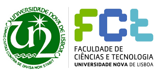

# 2020 Algorithm and Distributed Systems @ FCT

    

# Introduction
This contains reports for the project "publish/subscribe system based on Topics" assigned in the class "Algorithm and Distributed Systems" 2019/ 2020.
The course was attended at NOVA Faculdade de Ciencias e Tecnologia, in Lisbon.

For the project, both [paxos](https://lamport.azurewebsites.net/pubs/lamport-paxos.pdf) and [multi-paxos](https://www.cs.cornell.edu/courses/cs7412/2011sp/paxos.pdf) protocol were re-implemented.

The project has been done with [João Costa (@joaomcosta)](https://github.com/joaomcosta) and [Pedro Guilherme De Silva (@pedrogdesilva)](https://github.com/pedrogdesilva)

# Structure

The Folders are structured as follow:

- Phase 1
  - **arguments**:
    - HyParView
    - Broadcast
    - Publish/Subscribe (non-distributed protocol)
  - **code**: `./code`
  - **documentation**: `./docs/ASD_Project_Phase1.pdf`
  - **schema**: 
        

            
        

- Phase 2
  - **arguments**:
    - HyParView
    - Broadcast
    - Publish/Subscribe (distributed protocol)
    - Chord
    - Scribe
    - Paxos
  - **code**: `./code`
  - **documentation**: `./docs/ASD_Project_Phase2.pdf`
  - **schema**: 
        

            
        

- Phase 3
  - **arguments**:
    - HyParView
    - Broadcast
    - Publish/Subscribe (distributed protocol)
    - Chord
    - Scribe
    - Multi-Paxos
  - **code**: `./code`
  - **documentation**: `./docs/ASD_Project_Phase3.pdf`
  - **schema**: 
        

            
        

# Contacts

If you are interested in something, don't hesitate to contact me or open an issue.
